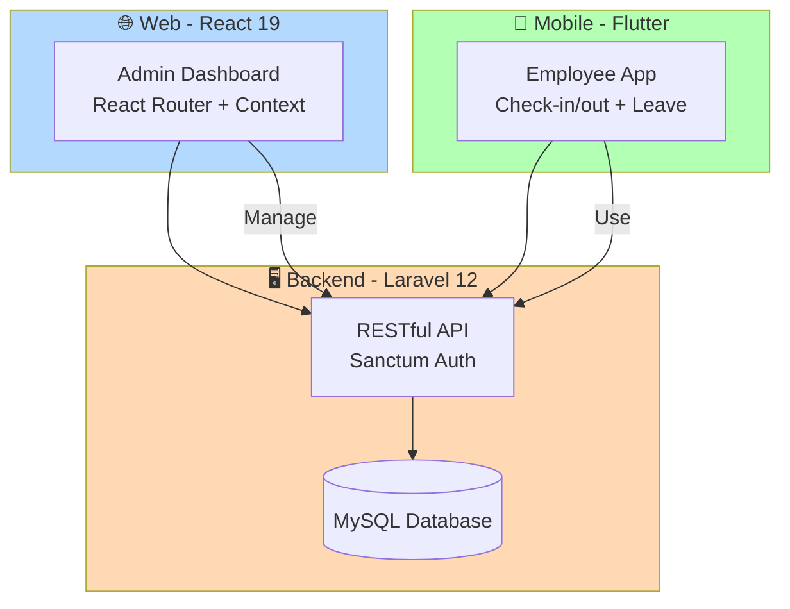
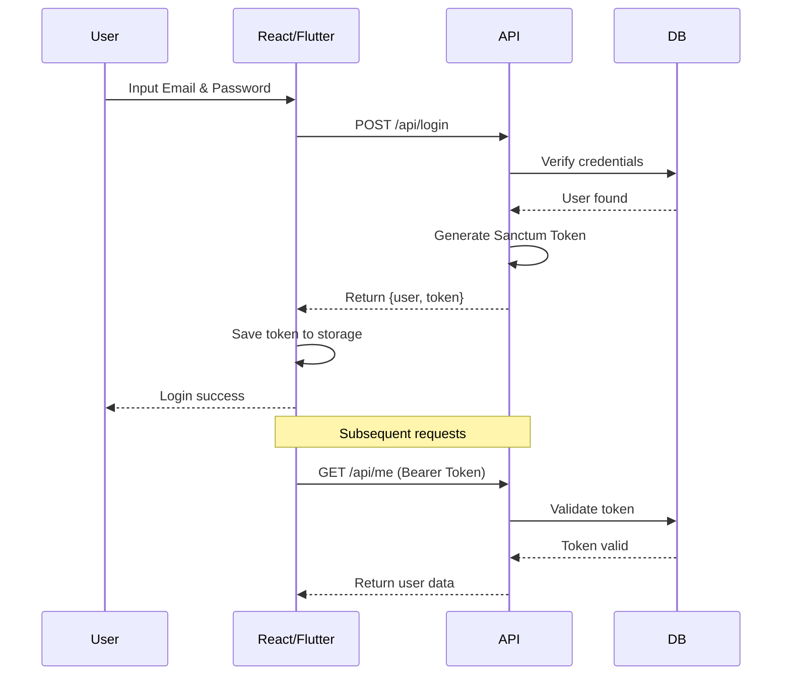
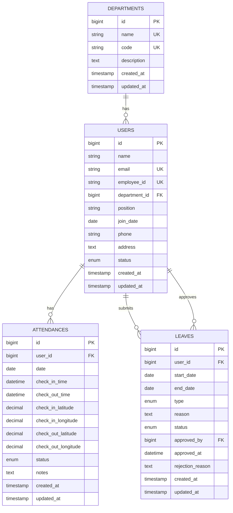

# README.md

<div align="center">

# 🏢 HRIS System - Human Resource Information System

**Sistem Manajemen Karyawan Terintegrasi dengan Laravel 12, React 19, dan Flutter**

[](https://github.com/yourusername/hris-system)
[](https://laravel.com/)
[](https://reactjs.org/)
[](https://flutter.dev/)
[](https://mysql.com/)
[](https://laravel.com/docs/sanctum)
[](https://restfulapi.net/)
[](LICENSE)

**Sistem HRIS lengkap dengan backend API, admin dashboard web, dan aplikasi mobile untuk karyawan**

</div>

---

## 📑 Daftar Isi

- [📋 Tentang Proyek](#-tentang-proyek)
- [✨ Fitur Unggulan](#-fitur-unggulan)
- [🏗️ Arsitektur Sistem](#️-arsitektur-sistem)
- [📁 Struktur Proyek](#-struktur-proyek)
- [🛠️ Teknologi yang Digunakan](#️-teknologi-yang-digunakan)
- [🚀 Cara Menjalankan](#-cara-menjalankan)
  - [⚡ Quick Development Start (All Services)](#-quick-development-start-all-services)
  - [🖥️ Terminal 1 — Backend Laravel](#️-terminal-1--backend-laravel)
  - [🌐 Terminal 2 — Admin React (Vite)](#-terminal-2--admin-react-vite)
  - [📱 Terminal 3 — Mobile Flutter (Web Mode)](#-terminal-3--mobile-flutter-web-mode)
- [🔥 Production Build](#-production-build)
  - [Laravel](#laravel)
  - [React (Vite)](#react-vite)
  - [Flutter Web](#flutter-web)
- [📂 Struktur Monorepo](#-struktur-monorepo)
- [🔐 Authentication Flow](#-authentication-flow)
- [📊 Database Diagram](#-database-diagram)
- [📋 API Documentation](#-api-documentation)
- [📱 Screenshots Aplikasi](#-screenshots-aplikasi)
- [🤝 Kontribusi](#-kontribusi)
- [📝 Lisensi](#-lisensi)

---

## 📋 Tentang Proyek

**HRIS System** adalah aplikasi manajemen sumber daya manusia yang dirancang untuk memudahkan administrasi karyawan, pencatatan kehadiran, dan pengelolaan cuti. Sistem ini terdiri dari tiga komponen utama:

1. **Backend API** (Laravel 12) - RESTful API dengan authentication Sanctum
2. **Admin Dashboard** (React 19) - Web app untuk admin mengelola data
3. **Mobile App** (Flutter) - Aplikasi mobile untuk karyawan check-in/out dan pengajuan cuti

---

## ✨ Fitur Unggulan

### 🔐 **Authentication & Authorization**
- Login/Logout dengan token Sanctum
- Role-based access (Admin vs Employee)
- Proteksi route di semua platform

### 👥 **Manajemen Karyawan**
- CRUD karyawan dengan validasi
- Upload foto profil
- Filter dan pencarian
- Status aktif/non-aktif

### 🏢 **Manajemen Departemen**
- CRUD departemen
- Hitung jumlah karyawan per departemen
- Kode unik departemen

### ⏱️ **Tracking Kehadiran**
- Check-in/out dengan GPS (mobile)
- Validasi lokasi (radius kantor)
- Riwayat kehadiran
- Status: tepat waktu, terlambat, absent

### 📝 **Manajemen Cuti**
- Pengajuan cuti (sick, annual, unpaid, other)
- Approval multi-level
- Perhitungan sisa cuti otomatis
- Notifikasi status cuti

### 📊 **Laporan & Statistik**
- Dashboard dengan grafik
- Rekap kehadiran bulanan
- Laporan cuti per karyawan
- Export ke CSV/Excel

### 🌓 **Tampilan Responsif**
- Dark/light mode (web)
- Mobile-friendly design
- UI/UX modern dengan TailwindCSS

---

## 🏗️ Arsitektur Sistem



---

## 📁 Struktur Proyek

```
hris-system/
├── 📁 backend-laravel/           # Laravel 12 REST API
│   ├── 📁 app/
│   │   ├── 📁 Http/
│   │   │   ├── 📁 Controllers/
│   │   │   └── 📁 Requests/
│   │   ├── 📁 Models/
│   │   ├── 📁 Services/
│   │   └── 📁 Traits/
│   ├── 📁 database/
│   │   ├── 📁 migrations/
│   │   └── 📁 seeders/
│   ├── 📁 routes/
│   │   └── 📄 api.php
│   ├── 📄 .env.example
│   └── 📄 README.md
│
├── 📁 admin-react/               # React 19 Admin Dashboard
│   ├── 📁 public/
│   ├── 📁 src/
│   │   ├── 📁 components/
│   │   ├── 📁 contexts/
│   │   ├── 📁 hooks/
│   │   ├── 📁 layouts/
│   │   ├── 📁 pages/
│   │   ├── 📁 services/
│   │   └── 📁 utils/
│   ├── 📄 .env.example
│   ├── 📄 index.html
│   ├── 📄 package.json
│   └── 📄 vite.config.js
│
└── 📁 mobile_flutter/            # Flutter Mobile App
    ├── 📁 lib/
    │   ├── 📁 models/
    │   ├── 📁 screens/
    │   ├── 📁 services/
    │   ├── 📁 widgets/
    │   └── 📄 main.dart
    ├── 📁 android/
    ├── 📁 ios/
    ├── 📄 pubspec.yaml
    └── 📄 README.md
```

---

## 🛠️ Teknologi yang Digunakan

### Backend (Laravel 12)
| Teknologi | Versi | Fungsi |
|-----------|-------|--------|
| PHP | 8.2+ | Bahasa pemrograman |
| Laravel | 12 | Framework utama |
| Laravel Sanctum | 4.x | API Authentication |
| MySQL | 8.0+ | Database |
| Laravel Tinker | - | REPL |

### Admin Dashboard (React 19)
| Teknologi | Versi | Fungsi |
|-----------|-------|--------|
| React | 19 | Library UI |
| Vite | 6.x | Build tool |
| React Router | 7.x | Routing |
| Axios | 1.x | HTTP Client |
| TailwindCSS | 3.x | Styling |
| Recharts | 2.x | Grafik |
| React Hook Form | 7.x | Form handling |
| Lucide React | 0.477.x | Icons |

### Mobile App (Flutter)
| Teknologi | Versi | Fungsi |
|-----------|-------|--------|
| Flutter | 3.29+ | Framework UI |
| Dart | 3.7+ | Bahasa pemrograman |
| Dio | 5.x | HTTP Client |
| Provider/Bloc | - | State management |
| Geolocator | - | GPS tracking |

---

## 🚀 Cara Menjalankan

### ⚡ Quick Development Start (All Services)

Jalankan ketiga service menggunakan **3 terminal terpisah**.

---

### 🖥️ Terminal 1 — Backend Laravel

```bash
cd backend-laravel

# Install dependencies (first time only)
composer install

# Setup environment (first time only)
cp .env.example .env
php artisan key:generate

# Jalankan migration (first time only)
php artisan migrate --seed

# Jalankan server
php artisan serve
```

**Server berjalan di:**
```
http://127.0.0.1:8000
```

---

### 🌐 Terminal 2 — Admin React (Vite)

```bash
cd admin-react

# Install dependencies (first time only)
npm install

# Jalankan development server
npm run dev

npm run preview
npx serve dist
```

**Akses di:**
```
http://localhost:5173
```

---

### 📱 Terminal 3 — Mobile Flutter (Web Mode)

```bash
cd mobile_flutter

# Install dependencies (first time only)
flutter pub get

# Jalankan di Chrome (web mode)
flutter run -d chrome
```

**Akses di:**
```
http://localhost:5xxxx (akan muncul otomatis)
```

---

## 🔥 Production Build

### Laravel

Deploy ke server / VPS dengan Apache atau Nginx.

```bash
cd backend-laravel

# Optimasi untuk production
composer install --optimize-autoloader --no-dev
php artisan config:cache
php artisan route:cache
php artisan view:cache
php artisan serve
```

### React (Vite)

```bash
cd admin-react

# Build untuk production
npm run build
```

**Output berada di:**
```
admin-react/dist/
```

Hasil build siap di-upload ke hosting static atau diintegrasikan dengan Laravel.

### Flutter Web

```bash
cd mobile_flutter

# Build untuk web
flutter build web
```

**Output berada di:**
```
mobile_flutter/build/web/
```

Hasil build siap di-upload ke hosting static atau Firebase Hosting.

---

## 📂 Struktur Monorepo

```
hris-system/                  # Root repository
 ├── backend-laravel/         # Backend API (Laravel 12)
 ├── admin-react/              # Admin Dashboard (React 19)
 └── mobile_flutter/           # Mobile App (Flutter)
```

Setiap folder adalah project independent dengan dependency masing-masing.

---

## 🔐 Authentication Flow



---

## 📊 Database Diagram



---

## 📋 API Documentation

### Base URL
```
http://127.0.0.1:8000/api
```

### Authentication
| Method | Endpoint | Deskripsi |
|--------|----------|-----------|
| POST | `/login` | Login user |
| POST | `/logout` | Logout (auth) |
| GET | `/me` | Profile user (auth) |

### Employees
| Method | Endpoint | Deskripsi |
|--------|----------|-----------|
| GET | `/employees` | List all employees |
| POST | `/employees` | Create employee |
| GET | `/employees/{id}` | Get employee by ID |
| PUT | `/employees/{id}` | Update employee |
| DELETE | `/employees/{id}` | Delete employee |

### Departments
| Method | Endpoint | Deskripsi |
|--------|----------|-----------|
| GET | `/departments` | List departments |
| POST | `/departments` | Create department |
| GET | `/departments/{id}` | Get department |
| PUT | `/departments/{id}` | Update department |
| DELETE | `/departments/{id}` | Delete department |

### Attendance
| Method | Endpoint | Deskripsi |
|--------|----------|-----------|
| POST | `/attendance/check-in` | Check-in |
| POST | `/attendance/check-out` | Check-out |
| GET | `/attendance` | List attendance |
| GET | `/attendance/summary/{user}` | Monthly summary |

### Leaves
| Method | Endpoint | Deskripsi |
|--------|----------|-----------|
| GET | `/leaves` | List leaves |
| POST | `/leaves` | Create leave request |
| POST | `/leaves/{id}/approve` | Approve leave |
| POST | `/leaves/{id}/reject` | Reject leave |
| GET | `/leaves/balance/{user}` | Leave balance |

---

## 📱 Screenshots Aplikasi

*(Tambahkan screenshot di sini)*

### Admin Dashboard (React)
- Login Page
- Dashboard Overview
- Employee List
- Attendance Records
- Leave Management
- Reports

### Mobile App (Flutter)
- Login Screen
- Home Screen
- Check-in/out
- Leave Request Form
- Leave History
- Profile

---

## 🤝 Kontribusi

Kami sangat terbuka untuk kontribusi! Silakan ikuti langkah-langkah berikut:

1. Fork repository
2. Buat branch fitur (`git checkout -b feature/AmazingFeature`)
3. Commit perubahan (`git commit -m 'Add some AmazingFeature'`)
4. Push ke branch (`git push origin feature/AmazingFeature`)
5. Buat Pull Request

### Aturan Kontribusi
- Ikuti coding standard yang ada
- Tulis kode yang bersih dan terstruktur
- Tambahkan komentar untuk fungsi yang kompleks
- Update dokumentasi jika diperlukan
- Test perubahan Anda sebelum pull request

---

## 📝 Lisensi

Distributed under the MIT License. See `LICENSE` for more information.

---

## 📞 Kontak

- **Project Manager**: [me] - [ficramm@gmail.com]
- **Lead Backend**: [justme] - [ficramm@gmail.com]
- **Lead Frontend**: [onlyme] - [ficramm@gmail.com]
- **Lead Mobile**: [andme] - [ficramm@gmail.com]

**Project Link**: [https://github.com/ficrammanifur/hris-system](https://github.com/ficrammanifur/hris-system)

---

<div align="center">

### ⭐ Jika proyek ini bermanfaat, jangan lupa beri bintang! ⭐

**© 2026 HRIS System Team. All Rights Reserved.**

⬆ [Kembali ke Atas](#top)

</div>
