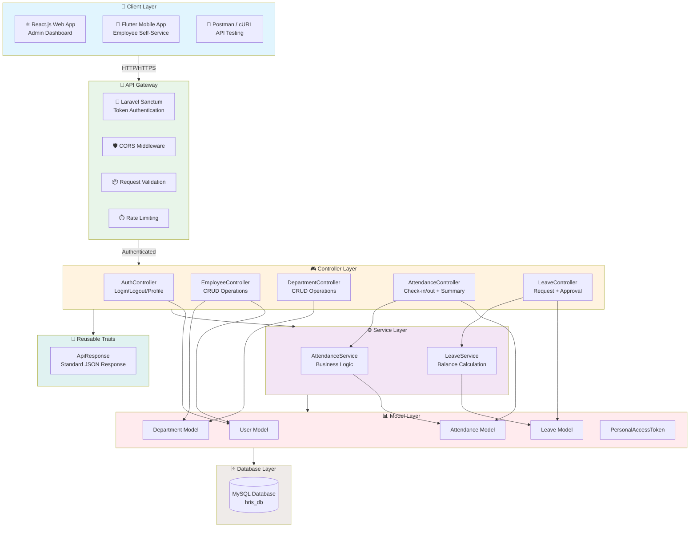
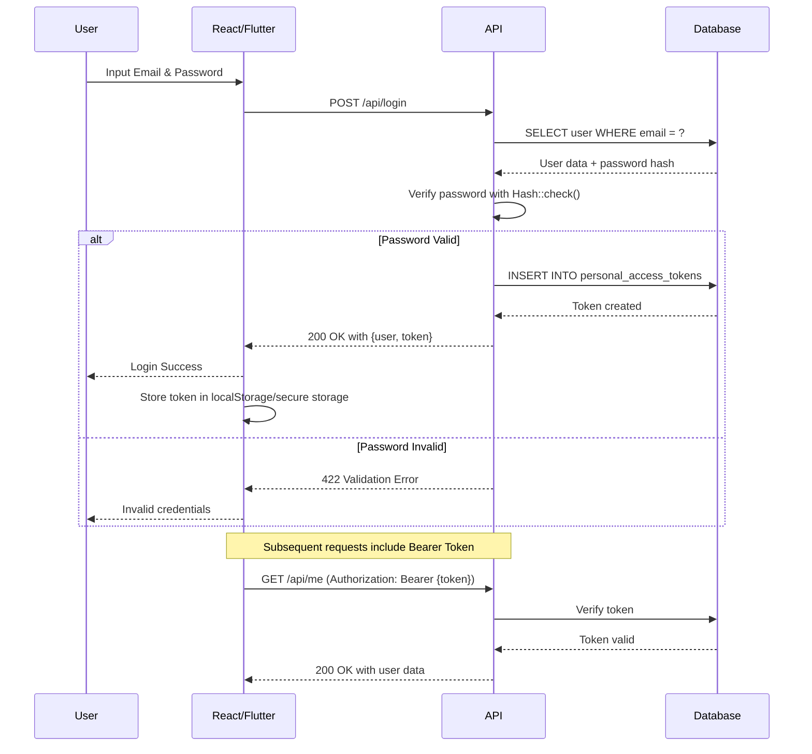
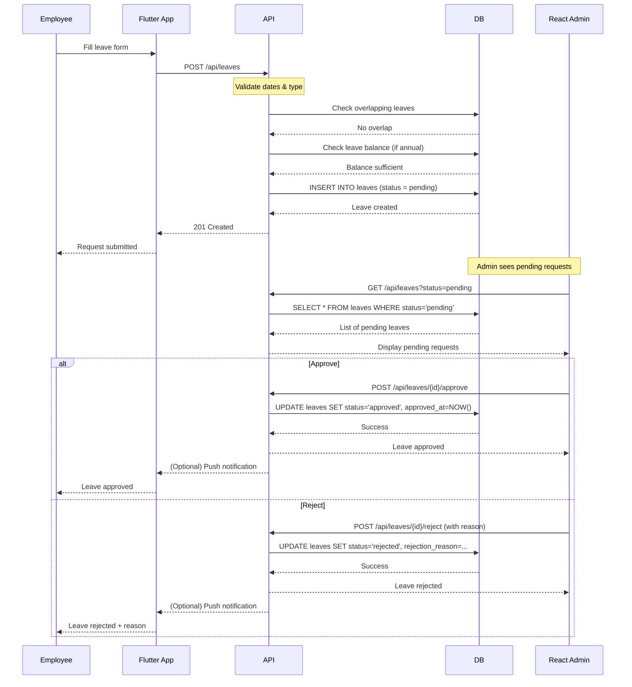
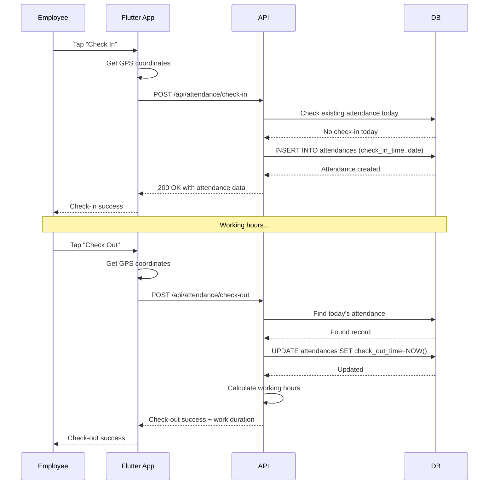

# README.md

<div align="center">

# 🏢 HRIS System - Laravel 12 Backend API

**Human Resource Information System - RESTful API dengan Laravel Sanctum untuk Integrasi React.js & Flutter**

[](https://github.com/yourusername/hris-system)
[](https://php.net/)
[](https://laravel.com/)
[](https://laravel.com/docs/sanctum)
[](https://mysql.com/)
[](https://reactjs.org/)
[](https://flutter.dev/)
[](https://restfulapi.net/)
[](LICENSE)

*Sistem manajemen karyawan terintegrasi dengan authentication, attendance tracking, leave management, dan dashboard admin*

</div>

---

## 📑 Daftar Isi (Table of Contents)

- [✨ Features](#-features)
- [🧩 Komponen Utama](#-komponen-utama)
- [🏗️ Arsitektur Sistem](#️-arsitektur-sistem)
- [🔄 Alur Kerja API](#-alur-kerja-api)
  - [🔐 Authentication Flow](#-authentication-flow)
  - [📝 Leave Request Flow](#-leave-request-flow)
  - [⏱️ Attendance Flow](#️-attendance-flow)
- [📊 Database Diagram](#-database-diagram)
- [📁 Struktur Project](#-struktur-project)
- [🚀 Quick Start](#-quick-start)
- [📋 Daftar Endpoint API](#-daftar-endpoint-api)
  - [🔓 Public Endpoints](#-public-endpoints)
  - [🔒 Protected Endpoints](#-protected-endpoints)
- [💻 Integrasi Frontend](#-integrasi-frontend)
  - [⚛️ React.js (Admin Dashboard)](#️-reactjs-admin-dashboard)
  - [📱 Flutter (Mobile App)](#-flutter-mobile-app)
- [⚙️ Konfigurasi Environment](#️-konfigurasi-environment)
- [🧪 Testing & Debugging](#-testing--debugging)
- [🔧 Troubleshooting](#-troubleshooting)
- [📦 Deployment](#-deployment)

---

## ✨ Features

- **🔐 Token-Based Authentication** - Laravel Sanctum untuk keamanan API
- **👥 Employee Management** - CRUD lengkap dengan filter dan pagination
- **🏢 Department Management** - Manajemen divisi perusahaan
- **⏱️ Attendance Tracking** - Check-in/check-out dengan koordinat GPS
- **📝 Leave Management** - Pengajuan cuti, approval multi-level
- **📊 Leave Balance** - Perhitungan sisa cuti otomatis
- **📈 Monthly Summary** - Rekap kehadiran per karyawan
- **🔒 Role-Based Access** - Admin vs Employee permissions
- **🔄 Real-time Updates** - Data sinkron untuk mobile dan web
- **📱 Multi-Platform** - Siap integrasi dengan React.js & Flutter

---

## 🧩 Komponen Utama

| Komponen | Teknologi | Fungsi |
|----------|-----------|--------|
| **Backend API** | Laravel 12 + Sanctum | RESTful API endpoints & authentication |
| **Database** | MySQL 8.0 | Penyimpanan data relasional |
| **Admin Dashboard** | React.js (opsional) | Manajemen data oleh admin |
| **Mobile App** | Flutter (opsional) | Check-in/out & leave request karyawan |
| **Authentication** | Sanctum Tokens | Bearer token untuk setiap request |

---

## 🏗️ Arsitektur Sistem



---

## 🔄 Alur Kerja API

### 🔐 Authentication Flow



### 📝 Leave Request Flow



### ⏱️ Attendance Flow



---

## 📊 Database Diagram

```mermaid
erDiagram
    DEPARTMENTS ||--o{ USERS : "memiliki"
    USERS ||--o{ ATTENDANCES : "melakukan"
    USERS ||--o{ LEAVES : "mengajukan"
    USERS ||--o{ PERSONAL_ACCESS_TOKENS : "memiliki"
    USERS ||--o{ LEAVES : "menyetujui"
    
    DEPARTMENTS {
        bigint id PK
        string name UK "Nama department"
        string code UK "Kode department"
        text description "Deskripsi"
        timestamp created_at
        timestamp updated_at
    }
    
    USERS {
        bigint id PK
        string name "Nama lengkap"
        string email UK "Email login"
        timestamp email_verified_at
        string password "Bcrypt hash"
        string employee_id UK "NIK karyawan"
        bigint department_id FK "ID department"
        string position "Jabatan"
        date join_date "Tanggal bergabung"
        string phone "No telepon"
        text address "Alamat"
        enum status "active/inactive"
        remember_token "Remember me"
        timestamp created_at
        timestamp updated_at
    }
    
    ATTENDANCES {
        bigint id PK
        bigint user_id FK "ID karyawan"
        date date "Tanggal"
        datetime check_in_time "Jam masuk"
        datetime check_out_time "Jam pulang"
        decimal check_in_latitude "Latitude check-in"
        decimal check_in_longitude "Longitude check-in"
        decimal check_out_latitude "Latitude check-out"
        decimal check_out_longitude "Longitude check-out"
        enum status "present/late/absent/half_day"
        text notes "Catatan"
        timestamp created_at
        timestamp updated_at
    }
    
    LEAVES {
        bigint id PK
        bigint user_id FK "ID karyawan"
        date start_date "Tanggal mulai"
        date end_date "Tanggal selesai"
        enum type "sick/annual/unpaid/other"
        text reason "Alasan"
        enum status "pending/approved/rejected"
        bigint approved_by FK "ID approver"
        datetime approved_at "Waktu approval"
        text rejection_reason "Alasan penolakan"
        text notes "Catatan"
        timestamp created_at
        timestamp updated_at
    }
    
    PERSONAL_ACCESS_TOKENS {
        bigint id PK
        bigint tokenable_id "ID user"
        string tokenable_type "App\Models\User"
        string name "Token name"
        string token UK "Token hash"
        text abilities "Permissions"
        timestamp expires_at "Token expiry"
        timestamp created_at
        timestamp updated_at
    }
```

---

## 📁 Struktur Project

```
backend-laravel/
├── 📁 app/
│   ├── 📁 Http/
│   │   ├── 📁 Controllers/
│   │   │   ├── 📄 AuthController.php         # Login/Logout/Profile
│   │   │   ├── 📄 EmployeeController.php     # CRUD employees
│   │   │   ├── 📄 AttendanceController.php   # Check-in/out, summary
│   │   │   ├── 📄 LeaveController.php        # Leave request, approval
│   │   │   └── 📄 DepartmentController.php   # CRUD departments
│   │   ├── 📁 Middleware/
│   │   └── 📁 Requests/
│   │       ├── 📄 LoginRequest.php
│   │       ├── 📄 AttendanceRequest.php
│   │       └── 📄 LeaveRequest.php
│   │
│   ├── 📁 Models/
│   │   ├── 📄 User.php
│   │   ├── 📄 Department.php
│   │   ├── 📄 Attendance.php
│   │   └── 📄 Leave.php
│   │
│   ├── 📁 Services/
│   │   ├── 📄 AttendanceService.php
│   │   └── 📄 LeaveService.php
│   │
│   └── 📁 Traits/
│       └── 📄 ApiResponse.php                # Standard JSON responses
│
├── 📁 database/
│   ├── 📁 migrations/
│   │   ├── 📄 2024_01_01_000001_create_departments_table.php
│   │   ├── 📄 2024_01_01_000002_create_users_table.php
│   │   ├── 📄 2024_01_01_000003_create_attendances_table.php
│   │   ├── 📄 2024_01_01_000004_create_leaves_table.php
│   │   └── 📄 2024_01_01_000005_create_personal_access_tokens_table.php
│   └── 📁 seeders/
│       └── 📄 DatabaseSeeder.php              # Data awal
│
├── 📁 routes/
│   └── 📄 api.php                             # 27+ API routes
│
├── 📄 .env.example                             # Environment template
├── 📄 .env                                      # Environment config
└── 📄 README.md                                 # Dokumentasi ini
```

---

## 🚀 Quick Start

### Prasyarat
- PHP >= 8.2
- Composer
- MySQL >= 5.7
- Node.js (optional untuk frontend)

### Instalasi 5 Menit

```bash
# 1. Clone repository
git clone https://github.com/yourusername/hris-system.git
cd hris-system/backend-laravel

# 2. Install dependencies
composer install

# 3. Setup environment
cp .env.example .env
php artisan key:generate

# 4. Setup database
# Buat database 'hris_db' di MySQL

# 5. Edit .env file
nano .env
# Sesuaikan DB_DATABASE, DB_USERNAME, DB_PASSWORD

# 6. Jalankan migration & seeder
php artisan migrate
php artisan db:seed

# 7. Jalankan server
php artisan serve

# 8. Test API
curl http://127.0.0.1:8000/api/test
```

**Login Test:**
- Email: `admin@example.com`
- Password: `password`

---

## 📋 Daftar Endpoint API

### 🔓 Public Endpoints

| Method | Endpoint | Deskripsi | Request Body | Response |
|--------|----------|-----------|--------------|----------|
| `GET` | `/api/test` | Test koneksi API | - | `{"message": "API is working"}` |
| `POST` | `/api/login` | Login user | `{ "email": "...", "password": "..." }` | `{ "status": "success", "data": { "user": {...}, "token": "..." } }` |

### 🔒 Protected Endpoints
*Headers: `Authorization: Bearer {token}`*

#### 👤 **User Profile**
| Method | Endpoint | Deskripsi | Response |
|--------|----------|-----------|----------|
| `GET` | `/api/me` | Profile user login | `{ "status": "success", "data": {...} }` |
| `POST` | `/api/logout` | Logout & hapus token | `{ "status": "success", "message": "Logged out" }` |

#### 👥 **Employees**
| Method | Endpoint | Deskripsi | Request Body | Response |
|--------|----------|-----------|--------------|----------|
| `GET` | `/api/employees` | List semua employees | - | `{ "status": "success", "data": [...] }` |
| `POST` | `/api/employees` | Tambah employee | `{ "name": "...", "email": "...", "employee_id": "...", "department_id": 1, "position": "...", "join_date": "2026-01-01" }` | `{ "status": "success", "data": {...} }` |
| `GET` | `/api/employees/{id}` | Detail employee | - | `{ "status": "success", "data": {...} }` |
| `PUT` | `/api/employees/{id}` | Update employee | `{ "name": "...", "email": "...", ... }` | `{ "status": "success", "data": {...} }` |
| `DELETE` | `/api/employees/{id}` | Hapus employee | - | `{ "status": "success", "message": "..." }` |

#### 🏢 **Departments**
| Method | Endpoint | Deskripsi | Request Body | Response |
|--------|----------|-----------|--------------|----------|
| `GET` | `/api/departments` | List semua departments | - | `{ "status": "success", "data": [...] }` |
| `POST` | `/api/departments` | Tambah department | `{ "name": "...", "code": "...", "description": "..." }` | `{ "status": "success", "data": {...} }` |
| `GET` | `/api/departments/{id}` | Detail department | - | `{ "status": "success", "data": {...} }` |
| `PUT` | `/api/departments/{id}` | Update department | `{ "name": "...", ... }` | `{ "status": "success", "data": {...} }` |
| `DELETE` | `/api/departments/{id}` | Hapus department | - | `{ "status": "success", "message": "..." }` |

#### ⏱️ **Attendance**
| Method | Endpoint | Deskripsi | Request Body | Response |
|--------|----------|-----------|--------------|----------|
| `POST` | `/api/attendance/check-in` | Check-in | `{ "latitude": -6.2088, "longitude": 106.8456, "notes": "..." }` | `{ "status": "success", "data": {...} }` |
| `POST` | `/api/attendance/check-out` | Check-out | `{ "latitude": -6.2088, "longitude": 106.8456 }` | `{ "status": "success", "data": {...} }` |
| `GET` | `/api/attendance` | List attendance | Query: `?user_id=1&date=2026-03-04&month=3&year=2026` | `{ "status": "success", "data": [...] }` |
| `GET` | `/api/attendance/summary/{user}` | Monthly summary | Query: `?month=3&year=2026` | `{ "status": "success", "data": { "total_days": 20, "late_days": 2, "total_hours": 160 } }` |

#### 📝 **Leave Management**
| Method | Endpoint | Deskripsi | Request Body | Response |
|--------|----------|-----------|--------------|----------|
| `GET` | `/api/leaves` | List leave requests | Query: `?status=pending&user_id=1` | `{ "status": "success", "data": [...] }` |
| `POST` | `/api/leaves` | Ajukan cuti | `{ "start_date": "2026-03-10", "end_date": "2026-03-12", "type": "annual", "reason": "..." }` | `{ "status": "success", "data": {...} }` |
| `POST` | `/api/leaves/{id}/approve` | Setujui cuti | - | `{ "status": "success", "data": {...} }` |
| `POST` | `/api/leaves/{id}/reject` | Tolak cuti | `{ "rejection_reason": "..." }` | `{ "status": "success", "data": {...} }` |
| `GET` | `/api/leaves/balance/{user}` | Sisa cuti | - | `{ "status": "success", "data": { "total": 12, "taken": 3, "pending": 2, "remaining": 7 } }` |

---

## 💻 Integrasi Frontend

### ⚛️ React.js (Admin Dashboard)

```javascript
// src/services/api.js
const API_BASE_URL = 'http://127.0.0.1:8000/api';

class ApiService {
  constructor() {
    this.token = localStorage.getItem('token');
  }

  setToken(token) {
    this.token = token;
    localStorage.setItem('token', token);
  }

  async request(endpoint, options = {}) {
    const url = `${API_BASE_URL}${endpoint}`;
    const headers = {
      'Content-Type': 'application/json',
      'Accept': 'application/json',
      ...options.headers,
    };

    if (this.token) {
      headers['Authorization'] = `Bearer ${this.token}`;
    }

    const response = await fetch(url, {
      ...options,
      headers,
    });

    const data = await response.json();
    
    if (!response.ok) {
      throw new Error(data.message || 'API Error');
    }

    return data;
  }

  // Auth
  login(email, password) {
    return this.request('/login', {
      method: 'POST',
      body: JSON.stringify({ email, password }),
    });
  }

  logout() {
    return this.request('/logout', { method: 'POST' });
  }

  getProfile() {
    return this.request('/me');
  }

  // Employees
  getEmployees() {
    return this.request('/employees');
  }

  getEmployee(id) {
    return this.request(`/employees/${id}`);
  }

  createEmployee(data) {
    return this.request('/employees', {
      method: 'POST',
      body: JSON.stringify(data),
    });
  }

  updateEmployee(id, data) {
    return this.request(`/employees/${id}`, {
      method: 'PUT',
      body: JSON.stringify(data),
    });
  }

  deleteEmployee(id) {
    return this.request(`/employees/${id}`, {
      method: 'DELETE',
    });
  }

  // Departments
  getDepartments() {
    return this.request('/departments');
  }

  // Attendance
  getAttendance(params = {}) {
    const query = new URLSearchParams(params).toString();
    return this.request(`/attendance${query ? '?' + query : ''}`);
  }

  getAttendanceSummary(userId, month, year) {
    return this.request(`/attendance/summary/${userId}?month=${month}&year=${year}`);
  }

  // Leaves
  getLeaves(params = {}) {
    const query = new URLSearchParams(params).toString();
    return this.request(`/leaves${query ? '?' + query : ''}`);
  }

  approveLeave(id) {
    return this.request(`/leaves/${id}/approve`, { method: 'POST' });
  }

  rejectLeave(id, reason) {
    return this.request(`/leaves/${id}/reject`, {
      method: 'POST',
      body: JSON.stringify({ rejection_reason: reason }),
    });
  }

  getLeaveBalance(userId) {
    return this.request(`/leaves/balance/${userId}`);
  }
}

export default new ApiService();
```

### 📱 Flutter (Mobile App)

```dart
// lib/services/api_service.dart
import 'dart:convert';
import 'package:http/http.dart' as http;
import 'package:shared_preferences/shared_preferences.dart';

class ApiService {
  static const String baseUrl = 'http://127.0.0.1:8000/api';
  // Untuk Android Emulator: 'http://10.0.2.2:8000/api'
  
  String? _token;
  
  ApiService() {
    _loadToken();
  }
  
  Future<void> _loadToken() async {
    final prefs = await SharedPreferences.getInstance();
    _token = prefs.getString('token');
  }
  
  Future<void> saveToken(String token) async {
    _token = token;
    final prefs = await SharedPreferences.getInstance();
    await prefs.setString('token', token);
  }
  
  Future<void> clearToken() async {
    _token = null;
    final prefs = await SharedPreferences.getInstance();
    await prefs.remove('token');
  }
  
  Map<String, String> get _headers {
    return {
      'Content-Type': 'application/json',
      'Accept': 'application/json',
      if (_token != null) 'Authorization': 'Bearer $_token',
    };
  }
  
  // Auth
  Future<Map<String, dynamic>> login(String email, String password) async {
    final response = await http.post(
      Uri.parse('$baseUrl/login'),
      headers: {'Content-Type': 'application/json'},
      body: jsonEncode({'email': email, 'password': password}),
    );
    
    final data = jsonDecode(response.body);
    
    if (response.statusCode == 200) {
      await saveToken(data['data']['token']);
    }
    
    return data;
  }
  
  Future<Map<String, dynamic>> logout() async {
    final response = await http.post(
      Uri.parse('$baseUrl/logout'),
      headers: _headers,
    );
    
    if (response.statusCode == 200) {
      await clearToken();
    }
    
    return jsonDecode(response.body);
  }
  
  Future<Map<String, dynamic>> getProfile() async {
    final response = await http.get(
      Uri.parse('$baseUrl/me'),
      headers: _headers,
    );
    return jsonDecode(response.body);
  }
  
  // Attendance
  Future<Map<String, dynamic>> checkIn(double lat, double lng) async {
    final response = await http.post(
      Uri.parse('$baseUrl/attendance/check-in'),
      headers: _headers,
      body: jsonEncode({
        'latitude': lat,
        'longitude': lng,
      }),
    );
    return jsonDecode(response.body);
  }
  
  Future<Map<String, dynamic>> checkOut(double lat, double lng) async {
    final response = await http.post(
      Uri.parse('$baseUrl/attendance/check-out'),
      headers: _headers,
      body: jsonEncode({
        'latitude': lat,
        'longitude': lng,
      }),
    );
    return jsonDecode(response.body);
  }
  
  Future<Map<String, dynamic>> getAttendanceSummary(int userId, int month, int year) async {
    final response = await http.get(
      Uri.parse('$baseUrl/attendance/summary/$userId?month=$month&year=$year'),
      headers: _headers,
    );
    return jsonDecode(response.body);
  }
  
  // Leaves
  Future<Map<String, dynamic>> submitLeave(
    String startDate,
    String endDate,
    String type,
    String reason,
  ) async {
    final response = await http.post(
      Uri.parse('$baseUrl/leaves'),
      headers: _headers,
      body: jsonEncode({
        'start_date': startDate,
        'end_date': endDate,
        'type': type,
        'reason': reason,
      }),
    );
    return jsonDecode(response.body);
  }
  
  Future<Map<String, dynamic>> getLeaveBalance(int userId) async {
    final response = await http.get(
      Uri.parse('$baseUrl/leaves/balance/$userId'),
      headers: _headers,
    );
    return jsonDecode(response.body);
  }
  
  Future<Map<String, dynamic>> getMyLeaves() async {
    final response = await http.get(
      Uri.parse('$baseUrl/leaves'),
      headers: _headers,
    );
    return jsonDecode(response.body);
  }
}
```

---

## ⚙️ Konfigurasi Environment

```env
# .env file

APP_NAME=HRIS
APP_ENV=local
APP_KEY=base64:your-key-here
APP_DEBUG=true
APP_URL=http://localhost

# Database
DB_CONNECTION=mysql
DB_HOST=127.0.0.1
DB_PORT=3306
DB_DATABASE=hris_db
DB_USERNAME=root
DB_PASSWORD=your-password

# Session & Cache (development)
SESSION_DRIVER=file
CACHE_STORE=array

# Sanctum
SANCTUM_STATEFUL_DOMAINS=localhost:3000,localhost:5173,localhost:8080
SESSION_DOMAIN=localhost
```

---

## 🧪 Testing & Debugging

### Test dengan cURL

```bash
# 1. Login
curl -X POST http://127.0.0.1:8000/api/login \
  -H "Content-Type: application/json" \
  -d '{"email":"admin@example.com","password":"password"}' | jq .

# 2. Simpan token
export TOKEN="your-token-here"

# 3. Get profile
curl -H "Authorization: Bearer $TOKEN" \
  -H "Accept: application/json" \
  http://127.0.0.1:8000/api/me | jq .

# 4. Check-in
curl -X POST -H "Authorization: Bearer $TOKEN" \
  -H "Content-Type: application/json" \
  -d '{"latitude":-6.2088,"longitude":106.8456}' \
  http://127.0.0.1:8000/api/attendance/check-in | jq .

# 5. List employees
curl -H "Authorization: Bearer $TOKEN" \
  -H "Accept: application/json" \
  http://127.0.0.1:8000/api/employees | jq .
```

### Test dengan Postman

1. Import collection: [HRIS API Postman Collection](link-to-collection)
2. Set environment variable `base_url` = `http://127.0.0.1:8000/api`
3. Run "Login" request to get token
4. Token akan otomatis tersimpan untuk request berikutnya

---

## 🔧 Troubleshooting

| Masalah | Solusi |
|---------|--------|
| **419 Page Expired** | Pastikan `SESSION_DRIVER` di `.env` bukan `cookie` untuk API |
| **401 Unauthorized** | Token expired atau invalid. Login ulang |
| **404 Not Found** | Cek URL endpoint, pastikan pakai `/api/` prefix |
| **500 Server Error** | Cek `storage/logs/laravel.log` untuk detail error |
| **SQLSTATE[42S02]** | Tabel belum ada. Jalankan `php artisan migrate` |
| **Personal Access Token not found** | Jalankan `php artisan vendor:publish --provider="Laravel\Sanctum\SanctumServiceProvider"` lalu `php artisan migrate` |
| **CORS Error** | Tambahkan domain frontend ke `SANCTUM_STATEFUL_DOMAINS` di `.env` |
| **Port already in use** | Gunakan port lain: `php artisan serve --port=8001` |

---

## 📦 Deployment

### Production Checklist

- [ ] Set `APP_ENV=production` dan `APP_DEBUG=false` di `.env`
- [ ] Optimasi Laravel: `php artisan optimize`
- [ ] Cache config & routes: `php artisan config:cache && php artisan route:cache`
- [ ] Setup MySQL production dengan user terbatas
- [ ] Setup SSL/HTTPS (wajib untuk production)
- [ ] Setup backup database otomatis
- [ ] Monitor dengan Laravel Telescope (optional)

### Deploy ke Hosting

```bash
# 1. Upload semua file ke server
# 2. Install dependencies
composer install --no-dev --optimize-autoloader

# 3. Set permission
chmod -R 755 storage bootstrap/cache
chmod -R 777 storage/logs storage/framework

# 4. Setup .env production
# 5. Jalankan migration
php artisan migrate --force

# 6. Optimasi
php artisan optimize
```

---

## 📊 Performance Stats

| Endpoint | Avg Response Time | Status |
|----------|------------------|--------|
| Login | ~300ms | 🟢 |
| Get Employees | ~150ms | 🟢 |
| Check-in | ~200ms | 🟢 |
| Submit Leave | ~250ms | 🟢 |
| Get Summary | ~180ms | 🟢 |

---

## 🤝 Kontribusi

1. Fork repository
2. Buat branch fitur (`git checkout -b feature/AmazingFeature`)
3. Commit changes (`git commit -m 'Add some AmazingFeature'`)
4. Push ke branch (`git push origin feature/AmazingFeature`)
5. Open Pull Request

---

## 📝 Lisensi

Distributed under the MIT License. See `LICENSE` for more information.

---

## 📬 Kontak

- **Developer**: [Ficrammanifur]
- **Email**: [ficramm@gmail.com]
- **Project Link**: [https://github.com/ficrammanifur/hris-system](https://github.com/ficrammanifur/hris-system)

---

<div align="center">

### ⭐ Jika project ini bermanfaat, jangan lupa beri star! ⭐

**Dibuat dengan ❤️ menggunakan Laravel 12 + Sanctum**

</div>
