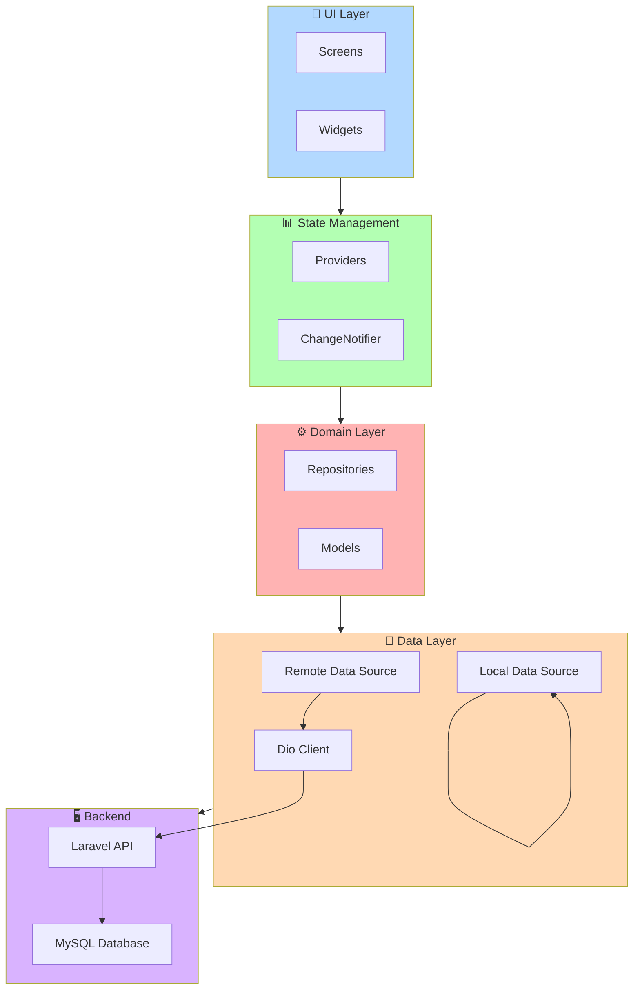
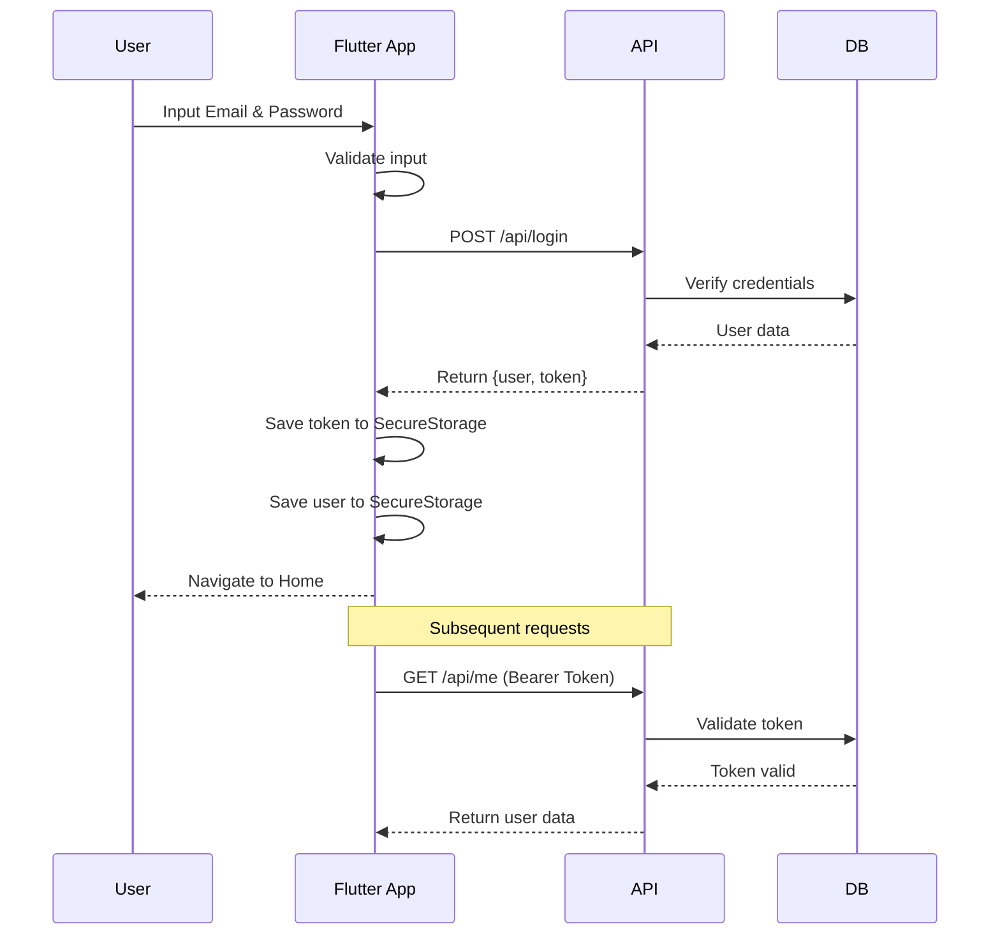
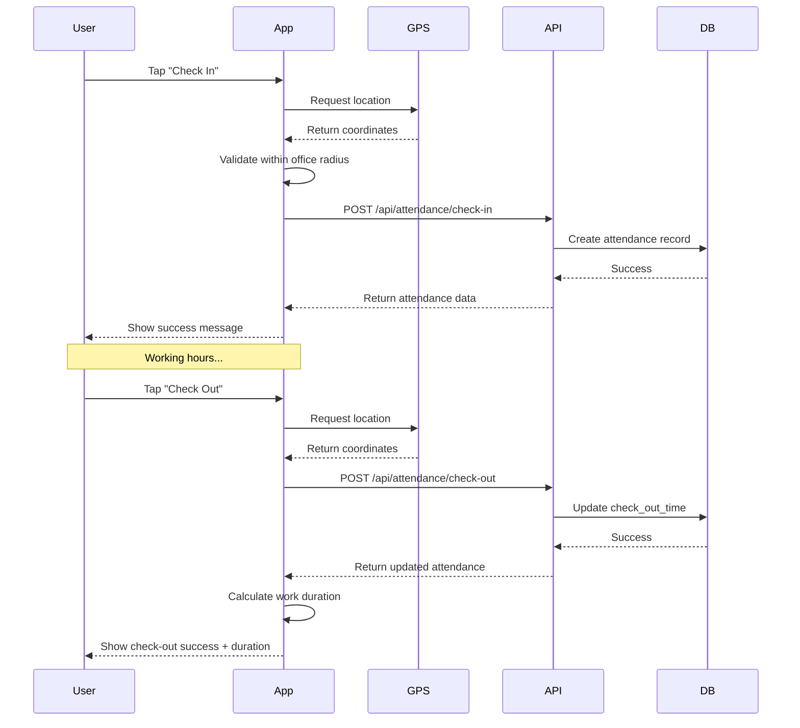
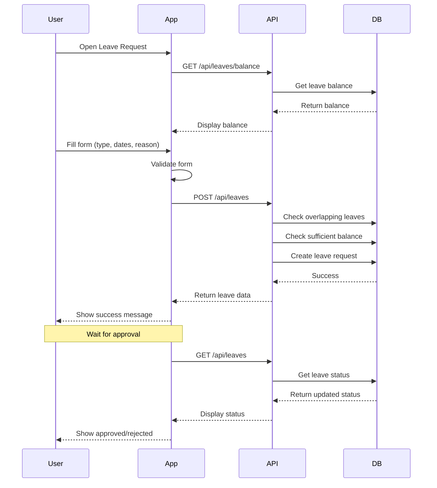

# README.md - Mobile Flutter

<div align="center">

# 📱 HRIS Mobile - Flutter Application

**Aplikasi Mobile untuk Karyawan - Check-in/out, Pengajuan Cuti, dan Monitoring Kehadiran**

[](https://flutter.dev/)
[](https://dart.dev/)
[](https://pub.dev/packages/provider)
[](https://laravel.com/)
[](https://flutter.dev)
[](LICENSE)

**Aplikasi mobile HRIS yang terintegrasi dengan backend Laravel untuk memudahkan karyawan dalam mengelola kehadiran dan cuti**

</div>

---

## 📑 Daftar Isi

- [✨ Fitur Aplikasi](#-fitur-aplikasi)
- [📱 Screenshots](#-screenshots)
- [🏗️ Arsitektur Aplikasi](#️-arsitektur-aplikasi)
- [📁 Struktur Proyek](#-struktur-proyek)
- [🛠️ Teknologi yang Digunakan](#️-teknologi-yang-digunakan)
- [🚀 Cara Menjalankan](#-cara-menjalankan)
  - [📋 Prasyarat](#-prasyarat)
  - [⚙️ Konfigurasi](#️-konfigurasi)
  - [▶️ Menjalankan Aplikasi](#️-menjalankan-aplikasi)
  - [📦 Build APK / IPA](#-build-apk--ipa)
- [🔐 Alur Autentikasi](#-alur-autentikasi)
- [📊 Alur Check-in/out](#-alur-check-inout)
- [📝 Alur Pengajuan Cuti](#-alur-pengajuan-cuti)
- [📡 API Integration](#-api-integration)
- [🧪 Testing](#-testing)
- [🐛 Troubleshooting](#-troubleshooting)
- [🤝 Kontribusi](#-kontribusi)
- [📝 Lisensi](#-lisensi)

---

## ✨ Fitur Aplikasi

### 🔐 **Autentikasi**
- Login dengan email dan password
- Token-based authentication (Laravel Sanctum)
- Auto-login (token tersimpan di secure storage)
- Logout

### 🏠 **Dashboard**
- Greeting card dengan nama karyawan
- Statistik kehadiran (total hari, total jam, sisa cuti)
- Quick action buttons (Check-in, Check-out, Leave Request)
- Recent activity (riwayat check-in/out dan cuti terbaru)
- Bottom navigation untuk akses cepat

### ⏱️ **Check-in/out**
- Deteksi lokasi GPS
- Validasi radius kantor
- Check-in dengan timestamp dan lokasi
- Check-out dengan durasi kerja
- Riwayat kehadiran

### 📝 **Pengajuan Cuti**
- Form pengajuan cuti (type, tanggal, alasan)
- Validasi saldo cuti
- Pilihan jenis cuti (annual, sick, unpaid, other)
- Riwayat pengajuan cuti
- Status cuti (pending/approved/rejected)

### 📊 **Monitoring**
- Sisa cuti
- Riwayat kehadiran
- Summary bulanan
- Statistik personal

### 👤 **Profil**
- Informasi personal karyawan
- Edit profil (nama, phone, address)
- Change password
- Dark/light mode toggle
- Logout

---

## 📱 Screenshots

| Login Screen | Dashboard | Check-in |
|:------------:|:---------:|:--------:|
|  |  |  |

| Leave Request | Leave History | Profile |
|:-------------:|:-------------:|:-------:|
|  |  |  |

*Screenshot akan ditambahkan setelah aplikasi dijalankan*

---

## 🏗️ Arsitektur Aplikasi



---

## 📁 Struktur Proyek

```
mobile_flutter/
├── 📁 android/                         # Native Android configuration
├── 📁 ios/                             # Native iOS configuration
├── 📁 web/                              # Web configuration
├── 📁 assets/                           # Static assets
│   ├── 📁 images/                        # PNG, JPG, SVG images
│   ├── 📁 icons/                          # App icons
│   └── 📁 fonts/                           # Custom fonts
│
├── 📁 lib/                               # Main source code
│   ├── 📄 main.dart                        # Entry point
│   │
│   ├── 📁 core/                            # Core utilities
│   │   ├── 📁 constants/                      # App constants
│   │   │   ├── 📄 api_constants.dart
│   │   │   └── 📄 app_constants.dart
│   │   ├── 📁 utils/                           # Helper functions
│   │   │   ├── 📄 date_formatter.dart
│   │   │   ├── 📄 validators.dart
│   │   │   └── 📄 permission_handler.dart
│   │   └── 📁 errors/                           # Error handling
│   │       ├── 📄 exceptions.dart
│   │       └── 📄 failures.dart
│   │
│   ├── 📁 data/                             # Data layer
│   │   ├── 📁 models/                          # Data models
│   │   │   ├── 📄 user_model.dart
│   │   │   ├── 📄 attendance_model.dart
│   │   │   ├── 📄 leave_model.dart
│   │   │   └── 📄 api_response.dart
│   │   ├── 📁 datasources/                      # Data sources
│   │   │   ├── 📁 remote/                          # API calls
│   │   │   │   ├── 📄 dio_client.dart
│   │   │   │   ├── 📄 auth_remote.dart
│   │   │   │   ├── 📄 attendance_remote.dart
│   │   │   │   └── 📄 leave_remote.dart
│   │   │   └── 📁 local/                           # Local storage
│   │   │       ├── 📄 shared_prefs.dart
│   │   │       └── 📄 secure_storage.dart
│   │   └── 📁 repositories/                      # Repository implementations
│   │       ├── 📄 auth_repository.dart
│   │       ├── 📄 attendance_repository.dart
│   │       └── 📄 leave_repository.dart
│   │
│   ├── 📁 providers/                         # State management
│   │   ├── 📄 auth_provider.dart
│   │   ├── 📄 attendance_provider.dart
│   │   ├── 📄 leave_provider.dart
│   │   └── 📄 theme_provider.dart
│   │
│   ├── 📁 screens/                           # UI screens
│   │   ├── 📁 splash/                           # Splash screen
│   │   │   └── 📄 splash_screen.dart
│   │   ├── 📁 auth/                             # Authentication
│   │   │   └── 📄 login_screen.dart
│   │   ├── 📁 home/                             # Home / Dashboard
│   │   │   └── 📄 home_screen.dart
│   │   ├── 📁 attendance/                       # Attendance features
│   │   │   ├── 📄 check_in_screen.dart
│   │   │   ├── 📄 check_out_screen.dart
│   │   │   ├── 📄 history_screen.dart
│   │   │   └── 📄 summary_screen.dart
│   │   ├── 📁 leave/                            # Leave management
│   │   │   ├── 📄 leave_request_screen.dart
│   │   │   ├── 📄 leave_history_screen.dart
│   │   │   └── 📄 leave_balance_screen.dart
│   │   └── 📁 profile/                          # User profile
│   │       ├── 📄 profile_screen.dart
│   │       └── 📄 edit_profile_screen.dart
│   │
│   ├── 📁 widgets/                           # Shared widgets
│   │   ├── 📄 custom_button.dart
│   │   ├── 📄 custom_text_field.dart
│   │   ├── 📄 bottom_nav_bar.dart
│   │   ├── 📄 greeting_card.dart
│   │   ├── 📄 stats_card.dart
│   │   ├── 📄 quick_action_buttons.dart
│   │   └── 📄 recent_activity.dart
│   │
│   ├── 📁 theme/                             # App theme
│   │   └── 📄 app_theme.dart
│   │
│   └── 📁 routes/                            # Navigation
│       ├── 📄 app_routes.dart
│       └── 📄 route_generator.dart
│
├── 📄 pubspec.yaml                           # Dependencies
├── 📄 .env                                    # Environment variables
├── 📄 .gitignore                              # Git ignore file
└── 📄 README.md                               # This file
```

---

## 🛠️ Teknologi yang Digunakan

| Teknologi | Versi | Fungsi |
|-----------|-------|--------|
| **Flutter** | 3.29+ | Framework UI |
| **Dart** | 3.7+ | Bahasa pemrograman |
| **Provider** | 6.1.2 | State management |
| **Dio** | 5.8.0 | HTTP Client |
| **Shared Preferences** | 2.5.2 | Local storage (non-sensitive) |
| **Flutter Secure Storage** | 9.2.4 | Secure storage (token) |
| **Geolocator** | 13.0.4 | GPS location |
| **Intl** | 0.20.2 | Date formatting |
| **Equatable** | 2.0.8 | Value equality |
| **Connectivity Plus** | 6.1.5 | Network connectivity |
| **Flutter Local Notifications** | 19.5.0 | Local notifications |

---

## 🚀 Cara Menjalankan

### 📋 Prasyarat

- **Flutter SDK** 3.29 atau lebih baru
- **Dart SDK** 3.7 atau lebih baru
- **Android Studio** / **VS Code** dengan Flutter extensions
- **Emulator** atau **device fisik** (Android/iOS)
- **Backend Laravel** berjalan (lihat panduan di folder `backend-laravel`)

### ⚙️ Konfigurasi

1. **Clone repository**
   ```bash
   git clone https://github.com/yourusername/hris-system.git
   cd hris-system/mobile_flutter
   ```

2. **Install dependencies**
   ```bash
   flutter pub get
   ```

3. **Konfigurasi environment**
   
   Edit `lib/core/constants/api_constants.dart`:
   ```dart
   // Untuk emulator Android
   static const String baseUrl = 'http://10.0.2.2:8000/api';
   
   // Untuk iOS simulator
   // static const String baseUrl = 'http://127.0.0.1:8000/api';
   
   // Untuk device fisik (gunakan IP komputer)
   // static const String baseUrl = 'http://192.168.1.100:8000/api';
   ```

4. **Pastikan backend Laravel berjalan**
   ```bash
   cd ../backend-laravel
   php artisan serve
   # Server running on http://127.0.0.1:8000
   ```

### ▶️ Menjalankan Aplikasi

```bash
# Kembali ke folder mobile_flutter
cd ../mobile_flutter

# Jalankan di emulator/device
flutter run

# Jalankan di Chrome (web mode)
flutter run -d chrome

# Jalankan dengan mode release
flutter run --release
```

### 📦 Build APK / IPA

```bash
# Build APK untuk Android
flutter build apk --release
# Output: build/app/outputs/flutter-apk/app-release.apk

# Build App Bundle untuk Play Store
flutter build appbundle --release
# Output: build/app/outputs/bundle/release/app-release.aab

# Build IPA untuk iOS (MacOS only)
flutter build ios --release
# Output: build/ios/iphoneos/Runner.app

# Build untuk web
flutter build web
# Output: build/web/
```

---

## 🔐 Alur Autentikasi



---

## 📊 Alur Check-in/out



---

## 📝 Alur Pengajuan Cuti



---

## 📡 API Integration

### Base URL
```
http://127.0.0.1:8000/api
```

### Endpoints yang Digunakan

| Method | Endpoint | Deskripsi |
|--------|----------|-----------|
| `POST` | `/login` | Login user |
| `POST` | `/logout` | Logout |
| `GET` | `/me` | Get current user |
| `POST` | `/attendance/check-in` | Check-in |
| `POST` | `/attendance/check-out` | Check-out |
| `GET` | `/attendance` | List attendance |
| `GET` | `/attendance/summary/{user}` | Monthly summary |
| `GET` | `/leaves` | List leaves |
| `POST` | `/leaves` | Submit leave |
| `GET` | `/leaves/balance/{user}` | Leave balance |

### Contoh Request

```dart
// Login
final response = await dio.post('/login', data: {
  'email': 'admin@example.com',
  'password': 'password',
});

// Check-in
final response = await dio.post('/attendance/check-in', data: {
  'latitude': -6.2088,
  'longitude': 106.8456,
  'notes': 'Check-in from office',
});

// Submit leave
final response = await dio.post('/leaves', data: {
  'start_date': '2026-03-10',
  'end_date': '2026-03-12',
  'type': 'annual',
  'reason': 'Family vacation',
});
```

---

## 🧪 Testing

```bash
# Run all tests
flutter test

# Run specific test
flutter test test/widget_test.dart

# Run with coverage
flutter test --coverage
genhtml coverage/lcov.info -o coverage/html
open coverage/html/index.html
```

---

## 🐛 Troubleshooting

| Masalah | Solusi |
|---------|--------|
| **Connection refused** | Pastikan backend Laravel berjalan di `http://127.0.0.1:8000` |
| **CORS error** | Untuk web, pastikan CORS di backend mengizinkan origin |
| **Location not working** | Pastikan permission location diaktifkan di device/emulator |
| **Token expired** | Login ulang, token akan diperbarui |
| **Build failed** | Jalankan `flutter clean` lalu `flutter pub get` |
| **Emulator not found** | Buka Android Studio, jalankan AVD Manager |
| **Package not found** | Jalankan `flutter pub outdated` untuk cek versi terbaru |

---

## 🤝 Kontribusi

1. Fork repository
2. Buat branch fitur (`git checkout -b feature/AmazingFeature`)
3. Commit perubahan (`git commit -m 'Add some AmazingFeature'`)
4. Push ke branch (`git push origin feature/AmazingFeature`)
5. Open Pull Request

### Panduan Kontribusi
- Ikuti struktur folder yang sudah ada
- Gunakan Provider untuk state management
- Tulis kode yang bersih dan terstruktur
- Tambahkan komentar untuk fungsi yang kompleks
- Update README jika diperlukan

---

## 📝 Lisensi

Distributed under the MIT License. See `LICENSE` for more information.

---

## 📞 Kontak

- **Developer**: [Nama Developer]
- **Email**: [developer@example.com]
- **Project Link**: [https://github.com/yourusername/hris-system](https://github.com/yourusername/hris-system)

---

## 🙏 Credits

- **Flutter Team** - Framework yang luar biasa
- **Laravel Team** - Backend API yang powerfull
- **All Contributors** - Yang telah membantu pengembangan

---

<div align="center">

### ⭐ Jika aplikasi ini bermanfaat, jangan lupa beri bintang! ⭐

**Made with ❤️ using Flutter**

</div>
